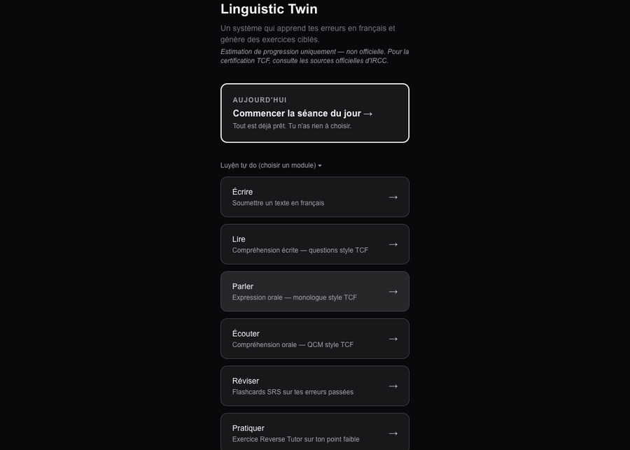
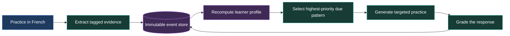
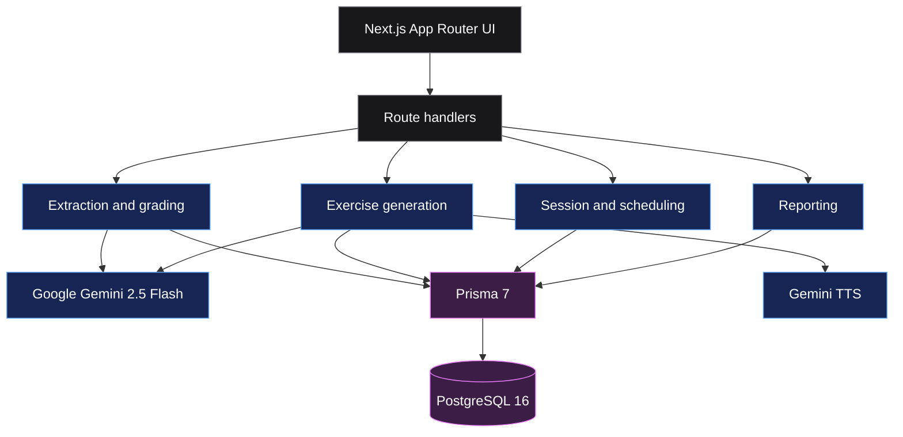

<div align="center">


# Linguistic Twin

**A stateful French learning system that turns your recurring mistakes into the next exercise.**

[](https://nextjs.org/)
[](https://www.typescriptlang.org/)
[](https://www.postgresql.org/)
[](https://www.prisma.io/)
[](https://ai.google.dev/)
[](#development)

[Features](#features) · [How it works](#how-it-works) · [Quick start](#quick-start) · [Architecture](#architecture) · [Development](#development)

<br />


</div>

Linguistic Twin is a local, single-learner system for preparing toward **TCF Canada B2 / NCLC 7**. It records language-production events, derives a rebuildable learner profile, and generates targeted practice from the patterns it finds.

This is a learner-modeling project rather than a course library. The learner supplies the evidence; the system decides what deserves attention next.

> [!IMPORTANT]
> Linguistic Twin is a personal learning and portfolio project. Its progress estimates are not official TCF results, and it is not affiliated with IRCC or the test provider.

## Product tour

<div align="center">
  
  <br />
  <sub>Home, writing analysis, and the guided daily queue. Session content shown in the tour is illustrative.</sub>
</div>

## Features

| | Capability | What it does |
|---|---|---|
| ✍️ | **Writing analysis** | Extracts span-level errors and whole-text observations, applies a fixed taxonomy, and scores coherence, vocabulary, grammar, and register. |
| 🔁 | **Reverse Tutor** | Generates sentences containing deliberate versions of the learner's most frequent due error, then grades detection and correction. |
| 🧠 | **Learner profile** | Recomputes error frequencies, vocabulary estimates, and complexity trends entirely from immutable practice events. |
| 🗓️ | **Daily session** | Builds a guided queue across vocabulary, grammar, listening, reading, speaking, and writing; skipped days never create an “overdue” state. |
| 🎧 | **Listening** | Creates dialogues or monologues, serves Gemini-generated WAV audio, and grades multiple-choice comprehension. |
| 📖 | **Reading** | Accepts pasted text or generates an article, creates comprehension questions, and writes mistakes back into the same profile. |
| 🎙️ | **Speaking** | Generates TCF-style prompts, transcribes recorded audio, and scores five speaking criteria. |
| 🗂️ | **Spaced repetition** | Schedules error flashcards with SM-2 and target tags on a separate 1–30 day mastery ladder. |
| 📊 | **Study reports** | Compares rolling seven-day windows, tracks skill metrics and focus tags, and provides a print-friendly PDF view. |
| 👩‍🏫 | **Tutor mode** | Gives a human tutor a passcode-protected report, recent submission history, notes, and homework handoff. |

## How it works



The loop rests on three invariants:

1. `Submission` and `ErrorEvent` records are immutable evidence.
2. `Profile` is derived state and can always be deleted and rebuilt.
3. Every recorded error uses one of **57 normalized tags across 6 categories**, or the explicit `uncategorized` fallback.

## Architecture



| Layer | Main modules | Responsibility |
|---|---|---|
| Ingestion | `frontend/lib/extractor.ts` | Structured error extraction, taxonomy enforcement, and writing rubric |
| Inference | `frontend/lib/profile.ts` | Pure recomputation of the learner model from stored events |
| Generation | `frontend/lib/generator.ts` | Reverse Tutor construction and response grading |
| Scheduling | `frontend/lib/targeting.ts`, `session.ts` | Due-target selection, mastery spacing, and daily queue state |
| Skills | `reading.ts`, `listening.ts`, `speaking.ts` | Per-skill generation, grading, transcription, and audio |
| Reporting | `frontend/lib/report.ts` | Deterministic rolling-window analytics shared by learner and tutor views |

## Quick start

### Prerequisites

- Node.js **20.19+**, **22.12+**, or **24+**
- Docker with Docker Compose
- A [Gemini API key](https://aistudio.google.com/apikey)

### 1. Start PostgreSQL

From the repository root:

```bash
docker compose up -d
```

The database is exposed only on `127.0.0.1:5432`.

### 2. Install and configure the app

```bash
cd frontend
npm ci
cp .env.example .env
```

Set `GEMINI_API_KEY` in `frontend/.env`; the default `DATABASE_URL` already matches Docker Compose. For local single-user development, the seeded `DEV_USER_ID` remains available as a development-only fallback.

### 3. Apply migrations and create the local user

```bash
npx prisma migrate deploy
npx prisma generate
npx ts-node --compiler-options '{"module":"CommonJS"}' prisma/seed.ts
docker compose -f ../docker-compose.yml exec db \
  psql -U twin twin_dev -c 'SELECT id, email FROM "User";'
```

Copy the returned user ID into `DEV_USER_ID` in `frontend/.env`. Set `TUTOR_PASSCODE` as well if you plan to use the legacy local `/tutor` view.

For multi-user development, create a Google OAuth web client and add this callback URL:

```text
http://localhost:3000/api/auth/callback/google
```

Then set `BETTER_AUTH_URL`, `BETTER_AUTH_SECRET`, `GOOGLE_CLIENT_ID`, and `GOOGLE_CLIENT_SECRET`. Generate a strong `BETTER_AUTH_SECRET`; never reuse the development fallback in a deployment.

### 4. Run the app

```bash
npm run dev
```

Open [http://localhost:3000](http://localhost:3000).

## Configuration

| Variable | Required | Purpose |
|---|---:|---|
| `DATABASE_URL` | Yes | PostgreSQL connection string |
| `GEMINI_API_KEY` | Yes | Extraction, generation, grading, transcription, and TTS |
| `BETTER_AUTH_URL` | Production | Public application origin used for OAuth callbacks |
| `BETTER_AUTH_SECRET` | Production | Signs and protects authentication state |
| `GOOGLE_CLIENT_ID` | Production auth | Google OAuth web client ID |
| `GOOGLE_CLIENT_SECRET` | Production auth | Google OAuth client secret |
| `DEV_USER_ID` | Local development only | Optional seeded learner fallback when no session exists |
| `TUTOR_PASSCODE` | Legacy local tutor mode | Signs access tokens for the `/tutor` dashboard |

> [!NOTE]
> Requests sent to Gemini can contain the learner's writing or voice transcript. Review the current Google AI data-use terms before using sensitive material.

## Routes

| Route | Experience |
|---|---|
| `/today` | Guided full or 10-minute study queue |
| `/submit` | Writing analysis and rubric |
| `/practice` | Next due Reverse Tutor target |
| `/flashcards` | SM-2 review of past errors |
| `/read`, `/listen`, `/speak` | TCF-style skill practice |
| `/dashboard` | Accumulated learner profile |
| `/report` | Rolling seven-day report and PDF-friendly print view |
| `/drill` | Reverse Tutor history |
| `/tutor` | Tutor report, history, notes, and homework |

## Project structure

```text
.
├── docker-compose.yml        # PostgreSQL 16 development service
├── docs/assets/              # README artwork and product tour
├── French_A0_to_A2_56_day_plan.xlsx
└── frontend/
    ├── app/                  # Pages, components, and API route handlers
    ├── lib/                  # Learner model and domain logic
    ├── prisma/               # Schema, migrations, and seed
    ├── scripts/              # Study-plan extraction utility
    └── docs/superpowers/     # Feature designs and implementation plans
```

## Development

```bash
cd frontend
npm test             # run the Vitest suite once
npm run test:watch   # run tests while editing
npm run lint
npm run build
```

The current suite contains **67 tests** covering identity isolation, classroom validation, deterministic sessions, targeting, the study plan, and reporting.

To regenerate `frontend/lib/plan.ts` after editing the spreadsheet:

```bash
cd frontend
node scripts/extract-plan.mjs
```

## Current scope

Linguistic Twin is transitioning from its original local single-user workflow to the Classroom Writing MVP described in [`docs/classroom-mvp/PRD.md`](docs/classroom-mvp/PRD.md). Google session authentication and the classroom membership schema are the first foundation; assignment and teacher-review screens are still under implementation. Twin does not claim an official proficiency score.

## Resetting local data

From the repository root:

```bash
docker compose stop       # stop PostgreSQL and preserve data
docker compose down -v    # remove the local database volume
```

## License

No license has been published for this repository. All rights are reserved by default.
