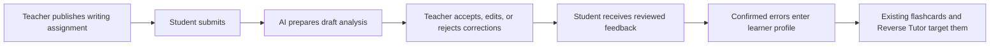

# Product Requirements Document — Classroom Writing MVP

**Product:** Linguistic Twin

**Status:** Draft for implementation

**Date:** 2026-09-13

**Owner:** Bruce Vo
**Primary pilot:** One French teacher and one class

## 1. Product summary

Linguistic Twin currently turns one learner's French mistakes into a derived profile, spaced review, and targeted exercises. The Classroom Writing MVP extends that loop to a real class by letting a teacher assign writing, review AI-proposed corrections, return feedback, and turn confirmed mistakes into each student's existing learner model.

The MVP is a teacher-controlled feedback workflow. AI prepares a draft; the teacher remains the final authority.

## 2. Problem

For a teacher:

- Reviewing every writing submission takes significant repeated effort.
- Recurring errors are difficult to track consistently across assignments.
- Feedback is usually disconnected from the student's next exercise.
- Existing general-purpose learning platforms do not use the student's confirmed mistakes to generate targeted review.

For a student:

- Feedback often explains one assignment but does not return at the right time for practice.
- It is difficult to see which mistakes recur and which ones are improving.
- Generic exercises are not grounded in their own language production.

## 3. Product goal

Prove one complete classroom learning loop:



The MVP succeeds when a small class can use this loop repeatedly without sharing accounts, exposing another student's work, or requiring the teacher to trust unreviewed AI output.

## 4. Pilot assumptions

- One teacher runs the initial pilot.
- One class contains approximately 5–15 students.
- The first pilot focuses on writing assignments only.
- Users can access a modern desktop or mobile browser.
- Every pilot participant has an approved sign-in method.
- French is the learning language; concise Vietnamese or English support may remain where it reduces friction.
- The pilot is not an official TCF assessment and does not produce an official CEFR decision.

If learners are minors, production use must wait for a separate consent, retention, and child-privacy review. The MVP requirements below assume adult learners or learners whose participation has been appropriately authorized.

## 5. Users and jobs

### Teacher

The teacher needs to:

- Create a class and invite students.
- Publish a writing prompt with a due date.
- See who has and has not submitted.
- Review AI-proposed errors efficiently.
- Edit incorrect AI feedback before a student sees it.
- Return clear feedback and request a revision.
- Understand recurring patterns for an individual student.

### Student

The student needs to:

- Join the correct class.
- See active assignments and due dates.
- Submit a French text using the existing writing experience.
- See only teacher-reviewed feedback.
- Submit a revised version when requested.
- Practice confirmed errors through the existing flashcard and Reverse Tutor flows.

## 6. MVP scope

### 6.1 Identity and access

- Users authenticate through an established authentication solution; Twin must not implement password cryptography from scratch.
- A user can be a teacher in one class and a student in another through classroom membership roles.
- Every protected server action derives the user ID from the authenticated session, never from `DEV_USER_ID` or a request body.
- Teacher routes require teacher membership in the relevant class.
- Student routes require active membership in the relevant class.
- The existing tutor passcode is retired from the classroom flow. It may remain temporarily as a legacy local-only route during migration.

### 6.2 Classroom

- A teacher can create a class with a name.
- A class has one random join code that the teacher can copy and rotate.
- A student can join using the code.
- A class page lists members and published assignments.
- The teacher can remove a student from the class.
- Removing membership blocks future access but does not silently delete prior learning records.

### 6.3 Writing assignment

- The teacher can create a draft containing:
  - Title.
  - Instructions or prompt.
  - Existing writing task type.
  - Optional due date.
- The teacher can publish or close an assignment.
- Every published assignment targets the whole class.
- A student can submit plain text through the existing writing form.
- A student can submit a new immutable attempt after the teacher requests revision.
- The assignment page shows each student's latest attempt and review state.

### 6.4 AI draft analysis

- Submission triggers the existing Gemini extraction and rubric services.
- AI output is stored as a review draft and is not shown as approved teacher feedback.
- An AI failure does not lose the student's submission.
- The teacher can retry analysis for a failed submission.
- Stored review metadata identifies the prompt version and model used.
- AI must not assign an official CEFR level or claim an official TCF score.

### 6.5 Teacher review

- The teacher sees the submitted text, assignment prompt, rubric draft, and every proposed correction.
- For each proposed correction, the teacher can accept, edit, or reject it.
- The teacher can add overall feedback.
- The teacher can choose:
  - **Return for revision** — feedback becomes visible and the student may submit another attempt.
  - **Approve** — feedback becomes visible and the attempt is complete.
- Finalization is idempotent: refreshing or retrying cannot create duplicate confirmed errors.
- Finalized corrections become immutable `ErrorEvent` records.
- The student's derived profile is recomputed after confirmed events are written.

### 6.6 Student feedback

- A student sees the teacher-reviewed corrections for their own submission.
- Every correction presents:
  - Original excerpt.
  - Corrected form.
  - Error category/tag in readable language.
  - Teacher-approved explanation.
- Overall teacher feedback appears before detailed corrections.
- When revision is requested, the student can create the next attempt from the same assignment.
- The UI clearly distinguishes AI processing, awaiting teacher review, revision requested, and complete states.

### 6.7 Existing adaptive practice

- Confirmed assignment errors flow into the existing `Profile` recomputation.
- Existing flashcard creation can surface confirmed errors.
- Existing targeting can select confirmed assignment errors for Reverse Tutor.
- Free practice through `/submit` continues to work during the pilot.
- The daily session does not need assignment scheduling in the first MVP release.

## 7. Primary user journeys

### Teacher creates the first class

1. Teacher signs in.
2. Teacher creates a class.
3. Twin creates a random join code.
4. Teacher shares the code outside Twin.
5. Students sign in and join.

**Acceptance criteria:**

- The class appears in the teacher's class list.
- The same user cannot join the same class twice.
- A user without membership cannot open the class URL.

### Teacher publishes an assignment

1. Teacher opens a class.
2. Teacher creates a writing assignment.
3. Teacher previews and publishes it.
4. Students see it in their class.

**Acceptance criteria:**

- Drafts are invisible to students.
- Published instructions and due date are identical for teacher and students.
- Closed assignments reject new submissions.

### Student submits writing

1. Student opens an assignment.
2. Student writes or pastes French text.
3. Student submits once.
4. Twin saves the immutable submission before requesting AI analysis.
5. The UI shows processing, ready for review, or analysis failed.

**Acceptance criteria:**

- Refreshing does not duplicate the attempt.
- AI failure never removes submitted content.
- A student cannot submit for another student.

### Teacher reviews and returns feedback

1. Teacher opens the review queue.
2. Teacher selects a submission.
3. Teacher accepts, edits, or rejects each proposed correction.
4. Teacher adds overall feedback.
5. Teacher returns the work for revision or approves it.

**Acceptance criteria:**

- Students cannot see draft AI feedback.
- Finalizing twice does not duplicate `ErrorEvent` rows.
- Rejected suggestions never enter the learner profile.
- Edited suggestions use the teacher's final correction and explanation.

### Student revises and receives targeted practice

1. Student reads reviewed feedback.
2. Student submits a new attempt if revision was requested.
3. Confirmed errors appear in their existing profile.
4. Flashcards or Reverse Tutor can target those errors.

**Acceptance criteria:**

- Attempts are ordered and cannot overwrite each other.
- The student cannot see another student's feedback.
- Existing targeting uses only confirmed `ErrorEvent` data.

## 8. Information architecture

### Shared

- `/classes` — classes available to the signed-in user.
- `/classes/join` — join a class with a code.
- `/classes/[classId]` — role-aware class overview.
- `/assignments/[assignmentId]` — assignment details and student attempt flow.
- `/submissions/[submissionId]/feedback` — reviewed feedback.

### Teacher

- `/teacher` — classes and review queue summary.
- `/teacher/classes/[classId]` — roster and assignments.
- `/teacher/classes/[classId]/assignments/new` — assignment editor.
- `/teacher/assignments/[assignmentId]` — completion and review status.
- `/teacher/reviews/[reviewId]` — correction review workspace.

Existing `/tutor` can redirect to `/teacher` after the classroom workflow replaces the passcode mode.

## 9. State model

### Assignment

```text
DRAFT → PUBLISHED → CLOSED
```

- Only teachers can move an assignment between states.
- A closed assignment remains readable but does not accept submissions.

### Submission review

```text
PROCESSING → AI_DRAFT → RETURNED_FOR_REVISION
                 └────→ APPROVED
PROCESSING → ANALYSIS_FAILED → PROCESSING (retry)
```

- `AI_DRAFT` is teacher-only.
- `RETURNED_FOR_REVISION` and `APPROVED` are visible to the submission owner.
- A revision creates a new submission and review; it does not reopen or mutate the previous attempt.

## 10. Success measures

The pilot records a baseline before Twin is used, then measures:

- Median teacher review time per writing submission.
- Assignment completion rate.
- Percentage of AI suggestions accepted, edited, and rejected.
- Percentage of returned assignments with a completed revision.
- Frequency with which confirmed errors reappear in later work.
- Successful analysis rate and retry rate.
- AI cost per reviewed submission.
- Authorization incidents or cross-student data exposure; the acceptable number is zero.

### MVP graduation criteria

- One teacher can run at least two complete assignment cycles with the pilot class.
- Every participating student can join, submit, receive feedback, and revise without developer intervention.
- Teacher review is measurably faster than the recorded baseline or the teacher reports a clear reduction in repetitive work.
- No unreviewed AI correction is presented as teacher-approved feedback.
- No cross-class or cross-student access is found in authorization tests or the pilot.

## 11. Non-functional requirements

### Security and privacy

- Authorization is enforced server-side on every classroom resource.
- Session cookies are HTTP-only, secure in production, and use an appropriate same-site policy.
- Join codes are random, rate-limited, and rotatable.
- Logs must not contain full submission text, tokens, or credentials.
- Only content needed for analysis is sent to the AI provider.
- Users can request export and deletion of their classroom data before public rollout.

### Reliability

- Submission persistence happens before AI analysis.
- AI failures are explicit and retryable.
- Teacher finalization uses a database transaction and is idempotent.
- Production database migrations are reviewed and applied before application rollout.
- Backups and restoration are verified before the pilot stores real student work.

### Accessibility and devices

- All assignment and review actions are keyboard accessible.
- Correction status cannot rely on color alone.
- Forms expose labels and useful validation messages.
- Student submission and feedback screens work at a 390px viewport.

### Performance and cost

- The MVP keeps analysis synchronous because pilot volume is low.
- The UI must preserve the submission while analysis is pending.
- AI calls are rate-limited per user.
- Model name, latency, failure, and estimated usage are recorded without storing sensitive prompt content in logs.

## 12. Explicitly out of scope

The following are not part of the Classroom Writing MVP:

- Multiple schools or organizations.
- School administrators or parent accounts.
- Group-specific or individual assignments.
- Attendance, schedules, live classes, messaging, or video calls.
- Payments or subscriptions.
- Leaderboards, points, streak competitions, or social feeds.
- General-purpose AI chat.
- Native mobile applications.
- File attachments, image OCR, or audio uploads.
- Reading, listening, and speaking assignments.
- Automatic official grading, CEFR certification, or TCF score prediction.
- A background job platform, message broker, microservices, or event bus.
- Advanced class analytics beyond assignment completion and the existing per-student report.

## 13. Follow-up candidates after MVP

Features may move into planning only after the writing pilot meets graduation criteria:

1. Add due classroom assignments to the daily session.
2. Extend the shared assignment lifecycle to reading.
3. Extend it to listening and speaking with appropriate storage/privacy work.
4. Aggregate confirmed error patterns at class level.
5. Add deadline notifications.
6. Add reusable assignment templates and report export.

## 14. Open product decisions

These decisions should be answered before implementation begins, but they do not expand MVP scope:

- Which sign-in method can every pilot student use?
- Are all pilot learners adults?
- What is the expected maximum class size in the first semester?
- Does the teacher want feedback written primarily in French, Vietnamese, or English?
- How long should submitted work be retained after a student leaves the class?
- May students continue using free practice without teacher review during the pilot?

## 15. Scope test

A proposed MVP feature is accepted only if it directly does one of the following:

1. Creates classroom learning evidence.
2. Helps the teacher validate that evidence.
3. Returns validated evidence to the student's existing practice loop.

Everything else remains out of scope until the pilot produces evidence that it is needed.
