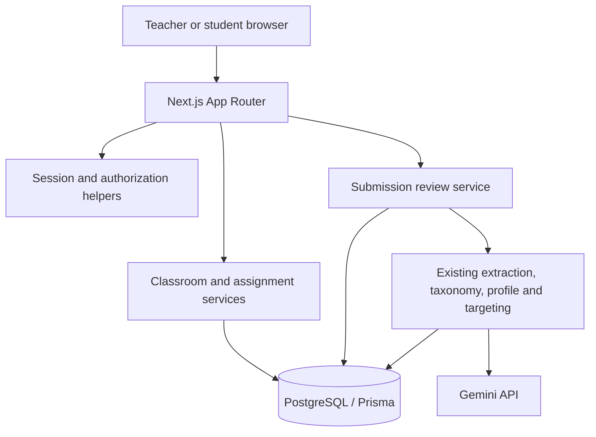

# System Design — Classroom Writing MVP

**Status:** Proposed

**Companion PRD:** [`PRD.md`](./PRD.md)
**Architecture principle:** Extend the existing Next.js monolith and immutable learning-event model with the smallest classroom boundary that supports a real pilot.

## 1. Current system

Twin is a single Next.js application containing:

- App Router pages and route handlers.
- PostgreSQL accessed through Prisma.
- Gemini-backed extraction, rubric scoring, generation, transcription, and TTS.
- Immutable `Submission` and `ErrorEvent` evidence.
- A rebuildable `Profile` derived from error events.
- Flashcard and error-tag scheduling.
- A single-user identity supplied by `DEV_USER_ID`.
- A passcode-protected tutor view tied to that single user.

The classroom MVP preserves the monolith, database, AI services, taxonomy, learner profile, targeting, flashcards, drills, reports, and UI design system.

## 2. Design principles

### Preserve confirmed evidence

`ErrorEvent` remains immutable and becomes the record of a teacher-confirmed language error for classroom submissions. AI suggestions are drafts and must not enter this table before review.

### One application, one database

Do not create a separate teacher backend, AI service, worker service, analytics database, or event bus. Next.js route handlers and server-side services remain the application boundary.

### Authorize close to data access

Every service that reads or mutates a classroom resource checks the authenticated user and membership. Hiding UI controls is not authorization.

### Reuse the writing pipeline

Free writing and assignment writing share validation, extraction, rubric scoring, taxonomy normalization, and rendering. Assignment context changes persistence and review behavior, not the language-analysis implementation.

### Store the AI draft as one review document

For the pilot, granular AI suggestions do not need independent relational rows. A typed JSON review document is simpler to edit and finalize atomically. Confirmed items are converted into normal `ErrorEvent` rows.

## 3. Target architecture



Deployment remains one web application plus one managed PostgreSQL database. No object storage is required for writing-only MVP.

## 4. Domain model

### New enums

```prisma
enum ClassroomRole {
  TEACHER
  STUDENT
}

enum AssignmentStatus {
  DRAFT
  PUBLISHED
  CLOSED
}

enum ReviewStatus {
  PROCESSING
  AI_DRAFT
  ANALYSIS_FAILED
  RETURNED_FOR_REVISION
  APPROVED
}
```

### New models

```prisma
model Classroom {
  id        String   @id @default(cuid())
  name      String
  joinCode  String   @unique
  createdAt DateTime @default(now())
  updatedAt DateTime @updatedAt

  memberships ClassroomMember[]
  assignments Assignment[]
}

model ClassroomMember {
  id          String        @id @default(cuid())
  classroomId String
  userId      String
  role        ClassroomRole
  joinedAt    DateTime      @default(now())

  classroom Classroom @relation(fields: [classroomId], references: [id], onDelete: Cascade)
  user      User      @relation(fields: [userId], references: [id], onDelete: Cascade)

  @@unique([classroomId, userId])
  @@index([userId])
}

model Assignment {
  id          String           @id @default(cuid())
  classroomId String
  createdById String
  title       String
  instructions String
  taskType    String
  dueAt       DateTime?
  status      AssignmentStatus @default(DRAFT)
  createdAt   DateTime         @default(now())
  updatedAt   DateTime         @updatedAt

  classroom  Classroom   @relation(fields: [classroomId], references: [id], onDelete: Cascade)
  createdBy  User        @relation("AssignmentCreator", fields: [createdById], references: [id])
  submissions Submission[]

  @@index([classroomId, status])
}

model SubmissionReview {
  id                 String       @id @default(cuid())
  submissionId       String       @unique
  status             ReviewStatus @default(PROCESSING)
  aiExtraction       Json?
  aiRubric           Json?
  reviewedExtraction Json?
  teacherFeedback    String?
  modelName          String?
  promptVersion      String?
  reviewedById       String?
  reviewedAt         DateTime?
  confirmedAt        DateTime?
  failureReason      String?
  createdAt          DateTime     @default(now())
  updatedAt          DateTime     @updatedAt

  submission Submission @relation(fields: [submissionId], references: [id], onDelete: Cascade)
  reviewedBy User?      @relation("SubmissionReviewer", fields: [reviewedById], references: [id])
}
```

### Changes to existing models

```prisma
model User {
  // Existing fields and relations remain.
  classroomMemberships ClassroomMember[]
  createdAssignments   Assignment[]       @relation("AssignmentCreator")
  completedReviews     SubmissionReview[] @relation("SubmissionReviewer")
}

model Submission {
  // Existing fields remain.
  assignmentId  String?
  attemptNumber Int     @default(1)

  assignment Assignment?      @relation(fields: [assignmentId], references: [id])
  review     SubmissionReview?

  @@unique([assignmentId, userId, attemptNumber])
  @@index([assignmentId, userId])
}
```

### Why there is no global `User.role`

Role belongs to a classroom relationship. The same person may teach one class and learn in another. A global enum would create exceptions or migration work later without simplifying authorization now.

### Why there is no `Organization`

The pilot has one independent teacher. Adding schools, departments, organization administrators, billing ownership, or nested tenancy would create authorization and lifecycle requirements that the MVP does not need.

### Why review data is JSON

The extractor already produces a typed nested result. During review, the teacher edits that document as a unit. Relational rows become valuable only if Twin needs analytics over rejected AI suggestions at scale. The pilot only needs aggregate acceptance/edit/rejection counts, which can be computed when finalizing and stored in review metadata if required.

## 5. Review document contract

`aiExtraction` stores the normalized extractor output. `reviewedExtraction` uses an application-level versioned contract:

```ts
type ReviewedExtractionV1 = {
  schemaVersion: 1;
  suggestions: Array<{
    id: string;
    decision: "accepted" | "edited" | "rejected";
    excerpt: string | null;
    correction: string;
    errorTag: ErrorTag;
    explanation: string;
  }>;
};
```

Rules:

- IDs are generated when the AI draft is stored and remain stable during editing.
- Rejected items remain in the review document for quality measurement but never become `ErrorEvent` rows.
- Edited tags are validated against the existing taxonomy before save and finalize.
- The server validates the complete document; client-side TypeScript is not a trust boundary.
- `schemaVersion` permits a future migration without introducing a generic schema framework.

## 6. Identity and authorization

### Authentication boundary

Add a server-only helper:

```ts
type AuthenticatedUser = { id: string; email: string; name: string | null };

async function requireUser(): Promise<AuthenticatedUser>;
```

An established authentication library or provider supplies secure sessions. The implementation must support:

- HTTP-only session cookies.
- CSRF protection appropriate to the chosen session strategy.
- Sign-out and session expiry.
- A stable provider identity mapped to the existing `User` table.
- A development-only helper for tests; production never falls back to `DEV_USER_ID`.

The specific provider is an implementation decision after confirming what sign-in method all pilot students can use.

### Authorization helpers

Keep authorization as small explicit functions:

```ts
async function requireClassRole(
  userId: string,
  classroomId: string,
  allowed: ClassroomRole[]
): Promise<ClassroomMember>;

async function requireAssignmentTeacher(userId: string, assignmentId: string): Promise<Assignment>;
async function requireSubmissionOwner(userId: string, submissionId: string): Promise<Submission>;
async function requireSubmissionTeacher(userId: string, submissionId: string): Promise<Submission>;
```

Do not build a generic policy engine. Four domain-specific helpers cover the MVP and remain easy to test.

### Authorization matrix

| Resource/action | Teacher member | Student member | Non-member |
|---|---:|---:|---:|
| View published assignment | Yes | Yes | No |
| View draft assignment | Yes | No | No |
| Publish or close assignment | Yes | No | No |
| Submit own attempt | No | Yes | No |
| View own reviewed feedback | No | Yes | No |
| View another student's submission | Yes | No | No |
| Edit/finalize review | Yes | No | No |
| View class roster | Yes | No in MVP | No |
| Remove member | Yes | No | No |

## 7. Application services

Create focused server-side modules rather than putting authorization and transactions directly in route files:

```text
frontend/lib/auth.ts
frontend/lib/classroom.ts
frontend/lib/assignments.ts
frontend/lib/submission-review.ts
```

### `classroom.ts`

- Create a classroom and teacher membership in one transaction.
- Generate and rotate a cryptographically random join code.
- Join a class idempotently.
- List a user's classrooms.
- Remove membership after teacher authorization.

### `assignments.ts`

- Validate task type using existing `TASK_TYPES`.
- Create and update teacher-owned drafts.
- Publish or close assignments.
- List assignments visible to a member.
- Compute next attempt number within the submission transaction.

### `submission-review.ts`

- Persist assignment submission first.
- Run existing extraction and rubric services.
- Store AI draft or analysis failure.
- Validate and save teacher edits.
- Finalize reviewed corrections into immutable error events.
- Recompute the profile after successful finalization.

## 8. Submission and analysis flow

### Preserve free practice

Existing `/api/submissions` behavior remains available for free practice during the pilot. Move its shared validation and AI calls into a service so the assignment endpoint can reuse them.

```ts
async function analyzeWriting(input: {
  content: string;
  taskType: TaskType;
  prompt?: string;
}): Promise<{ extraction: ExtractionResult; rubric: RubricResult | null }>;
```

### Assignment submission flow

```mermaid
sequenceDiagram
    participant S as Student
    participant API as Next route
    participant DB as PostgreSQL
    participant AI as Gemini

    S->>API: Submit assignment text
    API->>API: Authenticate and authorize student
    API->>DB: Transaction: create Submission + PROCESSING review
    DB-->>API: submissionId
    API->>AI: Existing extraction + rubric
    alt Analysis succeeds
      API->>DB: Save AI_DRAFT review
      API-->>S: Awaiting teacher review
    else Analysis fails
      API->>DB: Save ANALYSIS_FAILED
      API-->>S: Submitted; analysis will need retry
    end
```

The AI request stays synchronous in MVP. The submission already exists, so a timeout is recoverable. A teacher-triggered retry is sufficient for pilot volume; no background queue is introduced.

### Idempotency

- The client sends a generated idempotency key with assignment submission.
- A minimal `clientRequestId String? @unique` field may be added to `Submission` if double-submit behavior appears in testing.
- Do not add the field preemptively if disabling the submit control and transaction uniqueness prevent duplicates during the pilot.
- Teacher finalization uses `confirmedAt` as the mandatory idempotency guard.

## 9. Teacher finalization transaction

Finalization is the critical write path:

1. Authenticate the teacher.
2. Load review, submission, assignment, and classroom.
3. Verify teacher membership.
4. Validate the reviewed extraction contract and taxonomy tags.
5. Start a database transaction.
6. Update the review only when `confirmedAt IS NULL`.
7. Create `ErrorEvent` rows for accepted and edited suggestions.
8. Set review status, reviewer, timestamps, and `confirmedAt`.
9. Commit.
10. Recompute the student's `Profile` after commit.

If the idempotency update affects zero rows, return the already-finalized review without creating events again.

Profile recomputation remains rebuildable derived work. A recomputation failure is logged and retryable; it does not roll back confirmed evidence.

## 10. API surface

Route handlers stay thin and delegate to the services above.

### Classroom

| Method | Route | Purpose |
|---|---|---|
| `GET` | `/api/classes` | List the current user's memberships |
| `POST` | `/api/classes` | Create class and teacher membership |
| `POST` | `/api/classes/join` | Join with class code |
| `POST` | `/api/classes/[classId]/rotate-code` | Rotate join code |
| `DELETE` | `/api/classes/[classId]/members/[userId]` | Remove student membership |

### Assignments

| Method | Route | Purpose |
|---|---|---|
| `GET` | `/api/classes/[classId]/assignments` | List role-visible assignments |
| `POST` | `/api/classes/[classId]/assignments` | Create draft |
| `PATCH` | `/api/assignments/[assignmentId]` | Edit, publish, or close |
| `POST` | `/api/assignments/[assignmentId]/submissions` | Create student attempt and analyze |

### Reviews

| Method | Route | Purpose |
|---|---|---|
| `GET` | `/api/teacher/reviews` | List teacher's pending reviews |
| `GET` | `/api/reviews/[reviewId]` | Read review with authorized visibility |
| `PATCH` | `/api/reviews/[reviewId]` | Save teacher draft decisions |
| `POST` | `/api/reviews/[reviewId]/finalize` | Return or approve and create events |
| `POST` | `/api/reviews/[reviewId]/retry-analysis` | Retry a failed analysis |

Avoid GraphQL, RPC frameworks, and a generic CRUD layer. These routes reflect the actual user actions and authorization boundaries.

## 11. UI integration

### Shared shell

`AppShell` becomes session-aware:

- Signed-out state shows sign-in.
- Student membership adds Classes and Assignments.
- Teacher membership adds Teacher workspace and pending-review count.
- Existing practice routes remain available.

Do not create two separate applications or duplicate navigation.

### Reuse map

| Existing surface/module | Classroom use |
|---|---|
| `/submit` form | Extract shared `WritingForm`; pass assignment prompt and task type |
| `CorrectionMark` | Render reviewed excerpt and correction |
| Extractor and rubric | Generate teacher draft |
| Taxonomy | Validate teacher-approved tag |
| `Profile` recomputation | Include finalized assignment error events automatically |
| Flashcard API | Uses confirmed events without classroom-specific logic |
| Reverse Tutor targeting | Uses updated profile without classroom-specific logic |
| `/report` | Reuse as individual learner report linked from teacher workspace |
| `/tutor` | Transitional route; replace with teacher membership workflow |

### Avoid UI duplication

- One `WritingForm` handles free practice and assignment submission.
- One correction component renders AI drafts in editable mode and reviewed feedback in read-only mode.
- One assignment card is reused in teacher and student lists with role-specific actions.
- Class pages query different server data by role but share the established Correction Ledger design system.

## 12. Error and retry behavior

| Failure | Required behavior |
|---|---|
| Database unavailable before submit | Reject submit; keep text in browser and show retry |
| Database write succeeds, AI fails | Preserve submission; mark `ANALYSIS_FAILED` |
| Teacher retries AI | Replace only AI draft fields; never alter submission text |
| Teacher save fails | Keep local edits and show retry; do not report success |
| Finalization response is lost | Retry returns finalized result without duplicate events |
| Profile recomputation fails | Keep confirmed events; log and expose an admin retry path later if needed |
| Student opens another student's URL | Return 404 or 403 without leaking content metadata |
| Assignment closes while form is open | Reject submission with explicit closed state; preserve local text |

## 13. Validation and limits

Initial limits should be constants in application code, not a configuration platform:

- Classroom name: 1–100 characters.
- Assignment title: 1–150 characters.
- Instructions: 1–5,000 characters.
- Submission: use one explicit maximum suitable for the current Gemini prompt and enforce it server-side and client-side.
- Join code: at least 128 bits of randomness encoded in a copyable format, or a shorter display code backed by strict rate limiting.

The exact submission maximum should be chosen from observed current usage and AI model constraints during implementation; the design must not invent a value without measurement.

## 14. Observability

Use structured application logs and a small set of counters:

- Authentication success/failure without credentials.
- Authorization denial with resource type and opaque IDs.
- Submission persisted.
- Analysis success/failure, latency, model, and prompt version.
- Review finalized and counts of accepted/edited/rejected suggestions.
- Profile recomputation success/failure.

Do not log submission content, correction text, session tokens, join codes, or AI prompts containing learner content.

No separate analytics warehouse is required. Pilot product metrics can be produced with direct aggregate queries or a protected report.

## 15. Deployment shape

```text
Browser
   |
Single Next.js deployment
   |-- established authentication provider/library
   |-- Gemini API
   `-- managed PostgreSQL
```

Production requirements:

- Separate development and production databases.
- Secure environment variables for database, auth, and Gemini credentials.
- Prisma migrations applied as a deployment step.
- HTTPS and secure cookies.
- Automated database backups with one tested restore.
- Error monitoring and basic uptime checks.

The MVP does not require containers in production, Kubernetes, Redis, object storage, a CDN configuration project, or multiple deployment environments beyond development and production.

## 16. Migration strategy

### Migration 1 — Identity readiness

- Add authentication integration and provider identity mapping.
- Backfill or link the existing local `User`.
- Introduce `requireUser()`.
- Keep `DEV_USER_ID` only for explicit local development until all protected routes migrate.

### Migration 2 — Classroom foundation

- Add classroom and membership models.
- Create the pilot class and teacher membership.
- Add class creation, join, roster, and authorization tests.

### Migration 3 — Assignment and review storage

- Add assignment, submission relation, attempt number, and review model.
- Keep existing submissions valid with nullable `assignmentId`.
- Do not backfill free-practice submissions into assignments.

### Migration 4 — Writing vertical slice

- Extract shared writing analysis service.
- Implement assignment submission persistence-before-AI flow.
- Implement teacher review and idempotent finalization.
- Confirm existing profile, flashcard, and targeting flows consume finalized events.

### Migration 5 — Pilot UI

- Add class and assignment screens.
- Convert tutor functionality into teacher workspace where reused.
- Add student feedback and revision screens.
- Make `AppShell` role-aware.

### Migration 6 — Production hardening

- Complete route-by-route authorization audit.
- Add rate limits, privacy copy, data export/deletion procedure, monitoring, and backups.
- Run a closed pilot before adding more assignment types.

## 17. Test strategy

### Unit tests

- Classroom-role authorization matrix.
- Assignment state transitions.
- Review document validation.
- Accepted/edited/rejected conversion to `ErrorEvent` inputs.
- Idempotent finalization guard.

### Database integration tests

- Class creation and membership transaction.
- Duplicate join behavior.
- Attempt numbering under repeated submissions.
- Finalization creates the correct immutable events once.
- Existing profile recomputation includes finalized assignment events.

### Route tests

- Missing/expired session.
- Teacher and student access to every protected route.
- Cross-class and cross-student denial.
- Draft assignment visibility.
- Closed assignment submission rejection.
- Analysis failure and retry.

### Browser tests

- Teacher: create class → publish assignment → review submission.
- Student: join → submit → receive returned feedback → revise.
- Two simultaneous student identities prove isolation.
- Keyboard navigation and 390px mobile submission/feedback layouts.

## 18. Implementation milestones

### Milestone 0 — Decisions and baseline

**Deliverables:**

- Confirm pilot age group and sign-in method.
- Record current teacher review-time baseline.
- Agree on retention and feedback language.

**Exit condition:** Every pilot participant can use the chosen sign-in method.

### Milestone 1 — Authenticated classroom

**Deliverables:**

- Authentication, `requireUser`, classroom schema, join code, memberships, authorization helpers, and class UI.

**Exit condition:** Teacher and two test students can sign in; cross-user access tests pass.

### Milestone 2 — Assignment submission

**Deliverables:**

- Assignment lifecycle, role-aware lists, shared writing form, immutable attempts, persistence-before-analysis, and failure state.

**Exit condition:** A student can submit an assignment even when a simulated AI request fails.

### Milestone 3 — Teacher review loop

**Deliverables:**

- Review queue, editable AI draft, overall feedback, return/approve actions, idempotent finalization, and student feedback view.

**Exit condition:** Only teacher-approved errors become `ErrorEvent` rows, exactly once.

### Milestone 4 — Adaptive loop verification

**Deliverables:**

- Profile recomputation after finalization, flashcard visibility, Reverse Tutor targeting, and revision attempts.

**Exit condition:** A confirmed assignment error can be traced through profile → target → practice.

### Milestone 5 — Production pilot

**Deliverables:**

- Deployment, backups, monitoring, rate limits, privacy/consent copy, accessibility audit, and pilot runbook.

**Exit condition:** The teacher completes two real assignment cycles without developer data fixes.

## 19. Deliberate non-solutions

- **No microservices:** pilot traffic and team size do not justify network boundaries.
- **No job queue:** submissions persist before a synchronous AI call, making manual retry sufficient.
- **No organization hierarchy:** one classroom membership boundary covers the pilot.
- **No global RBAC framework:** explicit domain authorization helpers are easier to audit.
- **No relational table per AI suggestion:** typed review JSON is adequate until suggestion-level analytics proves necessary.
- **No new learner model:** confirmed classroom errors reuse the existing evidence and recomputation pipeline.
- **No assignment engine for every skill:** writing proves the shared lifecycle first.

## 20. Architecture acceptance checklist

- [ ] Production code does not use `DEV_USER_ID` for authorization.
- [ ] Every classroom query is scoped by authenticated membership.
- [ ] Assignment submissions are saved before AI is called.
- [ ] AI draft corrections do not create `ErrorEvent` rows.
- [ ] Teacher finalization is transactional and idempotent.
- [ ] Rejected suggestions never affect the learner profile.
- [ ] Existing free practice remains functional.
- [ ] Existing flashcards and Reverse Tutor consume confirmed assignment errors without duplicated logic.
- [ ] A 390px student flow and keyboard-only teacher review are usable.
- [ ] No out-of-scope platform infrastructure was added.
